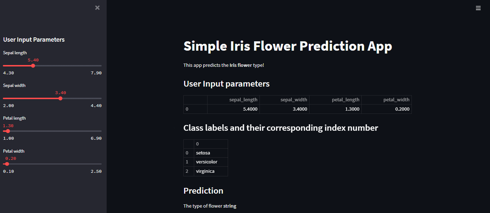

# Deploy-ML-model-using-Streamlit
# How to setup and run this project
- git clone https://github.com/kimty15/Deploy-ML-model-using-Streamlit.git
- cd Deploy-ML-model-using-Streamlit
- pip install -r requirements.txt
- Run : streamlit run app4.py 
# Interface App

